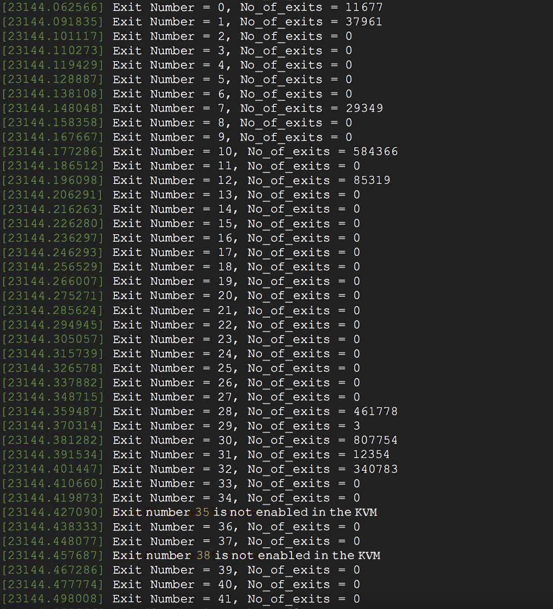
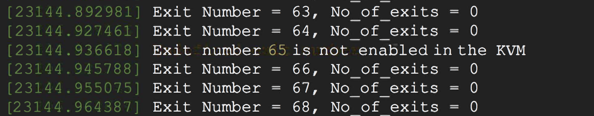

# CMPE283 : Virtualization

#### Assignment 4: Nested Paging vs. Shadow Paging
#### Name:  Puneet Tokhi
#### Professor: Michael Larkin

### Questions

**Q1. For each member in your team, provide 1 paragraph detailing what parts of the lab that member
implemented / researched. (You may skip this question if you are doing the lab by yourself).**

**Ans:** I did it by myself

#### Assignment instructions:
1. Run assignment 3 code and boot a test VM using that code. In my case, the test VM was also Ubuntu
2. Once the VM has booted, record total exit count information (total count for each type of exit handled by KVM). The CPUID leaf function used is `0x4FFFFFFD`
3. Shutdown the test (inner) VM.
4. Remove the ‘kvm-intel’ module from your running kernel using the command:
◦ `rmmod kvm-intel`
5. Find the module which is in the path: `/lib/modules/5.18.0-rc3+/kernel/arch/x86/kvm`
6. Reload the kvm-intel module with the parameter `ept=0`. This will disable nested paging and force the KVM to use shadow paging.
7. Boot the same test VM again, and capture the output again.

**Q2. Include a sample of your print of exit count output from dmesg from “with ept” and “without ept”.**

## `With EPT`
 
 
 
 
## `Without EPT`
 
 
 
 
 
 **Q3. What did you learn from the count of exits? Was the count what you expected? If not, why not?**
 
 **Ans:** There seemed to be a significant increase in the number of exits. The result was expected as there are large number of exits in shadow paging compared to nested paging due to increase in TLB flushes, CR3 exits and page faults. For example, in the case of exit type 0, which is exception or non-maskable interrupt, had only 11677 exits with EPT, but that number crossed over a million exits in the case of without ept. Also, I noticed that exit type 58(INVPCID) had 0 exit count with EPT, but without EPT that number was 28652. So, overall it was expected to see a large increase in exit types when the VM was run without EPT compared to running it with EPT.

 
 **Q4. What changed between the two runs (ept vs no-ept)?**
 
  **Ans:** A big change that I noticed was in the performance of the VM when it was running on no-ept. When no-ept was enabled, the VM was running much slower compared to with ept enabled slow. Also, there was a slighlt lag and the performance seemed slow while executing basic instructions and opening up my browser. Moreover, the VM boot up time also seemed to increase with no-ept compared to ept enabled. Also, I noticed that there were two additional exits, which was exit type 14 (INVLPG) and exit type 58 (INVPCID). These two exits occurred because of shadow paging which involves a TLB flush and for that we use the INVLPG command. Overall, I observed that between the two runs, exits count increase significantly in the case of no-ept compared to ept-enabled and the performance was noticeably slower in shadow paging compared to nested paging which was also expected.
