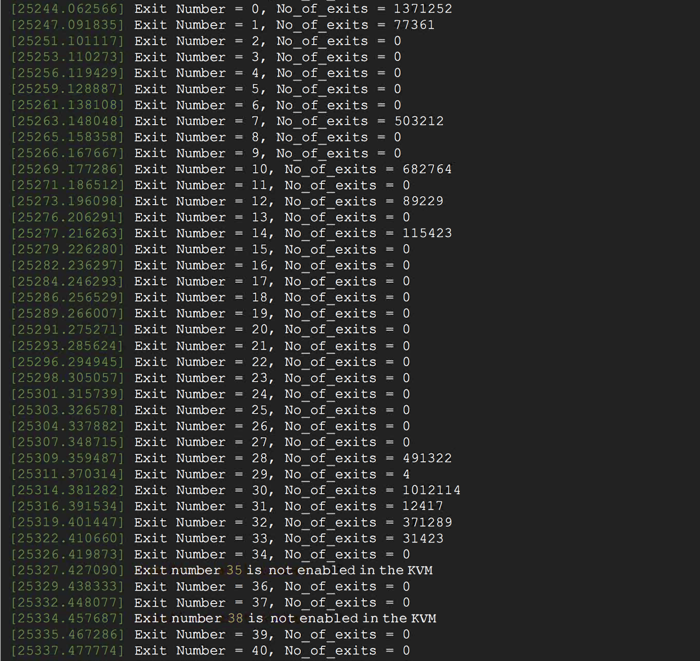
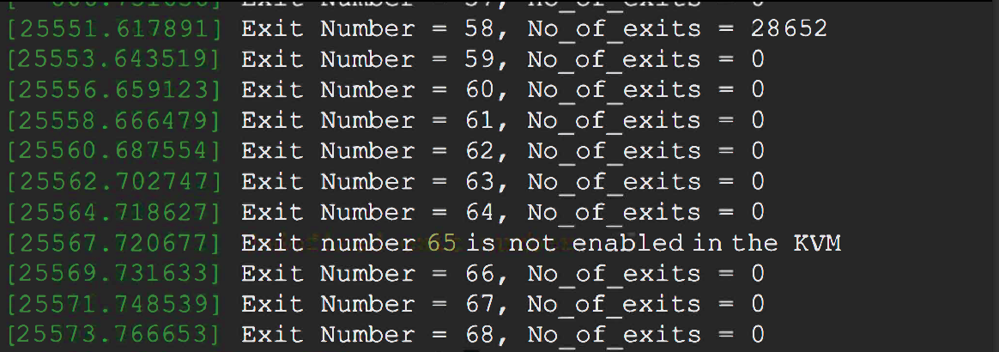

# CMPE283 : Virtualization

#### Assignment 4: Nested Paging vs. Shadow Paging
#### Name:  Puneet Tokhi
#### Professor: Michael Larkin

### Questions

**Q1. For each member in your team, provide 1 paragraph detailing what parts of the lab that member
implemented / researched. (You may skip this question if you are doing the lab by yourself).**

**Ans:** I did it by myself

#### Assignment instructions:
1. Run assignment 3 code and boot a test VM using that code. In my case, the test VM was also Ubuntu
2. Once the VM has booted, record total exit count information (total count for each type of exit handled by KVM). The CPUID leaf function used is `0x4FFFFFFD`
3. Shutdown the test (inner) VM.
4. Remove the ‘kvm-intel’ module from your running kernel using the command:
◦ `rmmod kvm-intel`
5. Find the module which is in the path: `/lib/modules/5.18.0-rc3+/kernel/arch/x86/kvm`
6. Reload the kvm-intel module with the parameter `ept=0`. This will disable nested paging and force the KVM to use shadow paging.
7. Boot the same test VM again, and capture the output again.

**Q2. Include a sample of your print of exit count output from dmesg from “with ept” and “without ept”.**
**Ans:** 
## `Without EPT`
 
 
 
